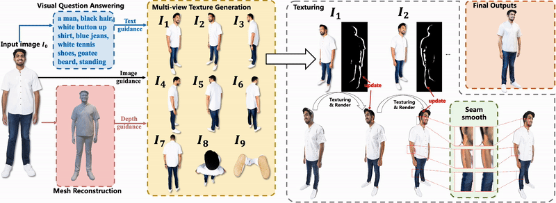

# Ultraman: Single Image 3D Human Reconstruction with Ultra Speed and Detail

The author has been busy with his undergraduate graduation recently, and code organization has been slightly delayed.
But the code is expected to be released by April 23th. 
If you are interested you can also see our concurrent work [Idea-2-3D](https://air-discover.github.io/Idea-2-3D/) :)

[You can see some interesting examples on the project homepage.](https://air-discover.github.io/Ultraman/)


## [🗂Project Page](https://air-discover.github.io/Ultraman/) | [](https://github.com/yisuanwang/Ultraman) | [](https://colab.research.google.com/drive/1u_lxxxxx) | [](https://arxiv.org/abs/2403.12028)

---
## ✨Introduction
Without any 3D or 2D pre-training, our proposed Ultraman is able to quickly synthesize complete, realistic and highly detailed 3D avatars based on a single input RGB image.




## 🗓ToDO List
<!-- ✅ -->
🔘1. Release offline version of Ultraman implementation

🔘2. Release online running version of Ultraman implementation 


## 📜Cite
```
@article{chen2024ultraman,
  title={Ultraman: Single Image 3D Human Reconstruction with Ultra Speed and Detail}, 
  author={Mingjin Chen and Junhao Chen and Xiaojun Ye and Huan-ang Gao and Xiaoxue Chen and Zhaoxin Fan and Hao Zhao},
  year={2024},
  eprint={2403.12028},
  archivePrefix={arXiv},
  primaryClass={cs.CV}
}
```
